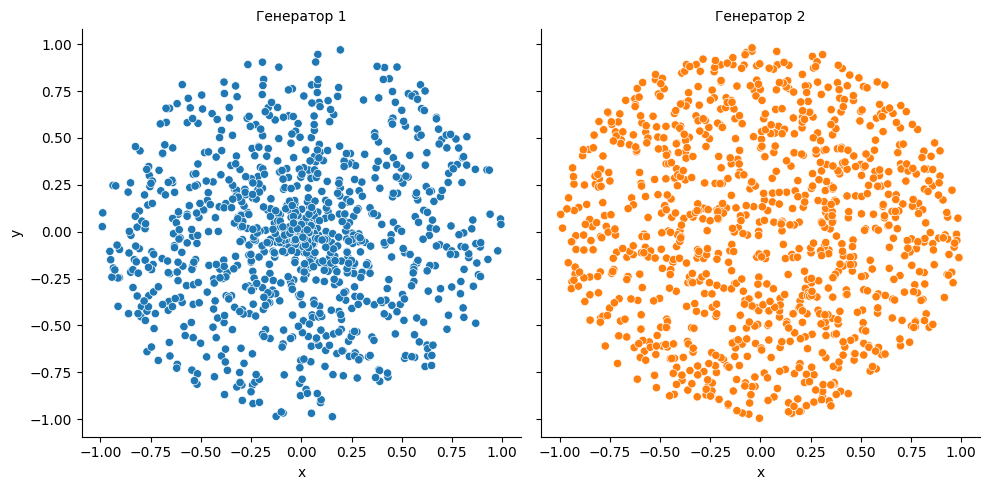
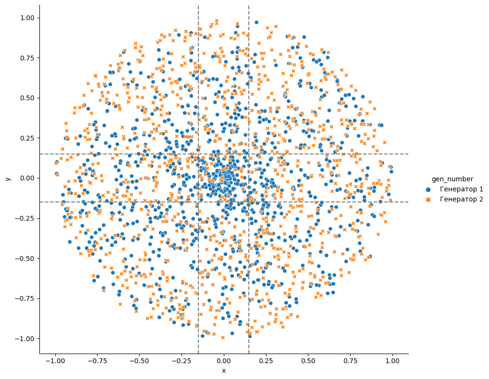

# [Генератор точек в круге](https://contest.yandex.ru/contest/28413/problems/A/)

Петя написал два генератора точек в круге:
```python
def generate1():
    a = uniform(0, 1)
    b = uniform(0, 1)
    return (a * cos(2 * pi * b), a * sin(2 * pi * b))

def generate2():
    while True:
        x = uniform(-1, 1)
        y = uniform(-1, 1)
        if x ** 2 + y ** 2 > 1:
            continue
        return (x, y)
```
Даны 100 наборов по 1000 точек, каждый набор сгенерирован каким-то одним из этих двух алгоритмов. Необходимо определить для каждого набора, первый или второй алгоритм использовался для его генерации. 
Для того, чтобы получить ОК по этой задаче, надо предсказать правильный генератор хотя бы для 98 наборов.

**Формат ввода**  
Даны 100 строк. Каждая строка отвечает за свой набор точек. В каждой строке находится 2000 действительных чисел (-1 <= a<sub>i</sub> <= 1), разделённых пробелом. Точки идут подряд, то есть формат строки: *x0 y0 x1 y2 x3 y3 x999 y999*

**Формат вывода**  
Нужно вывести 100 строк, в каждой из которой должно быть 1 число: 1 или 2, в зависимости от того, первым или вторым генератором был сгенерирован данный набор точек.

## Решение
1. Создадим по 1000 точек каждым генератором и нанесём их на координатную плоскость


2. В 1-ом наборе можем заметить скопление точек вокруг нуля. Точки второго набора распределены более равномерно. Посмотрим поближе.
 

3. Наибольшее скопление точек 1-го набора находится в области, ограниченной квадратом со стороной 0,3 и серединой в точке начала координат. Будем считать точку "околонулевой", если она принадлежит указанному квадрату. Посчитаем количество таких точек в наборах.

    | Генератор | Кол-во точек | Околонулевых точек |
    | :-: | - | - |
    | 1 | 1000 | 169 |
    | 2 | 1000 | 33 |

4. Проверим существует ли закономерность: будем генерировать 2000 точек (по тысяче каждым генератором) и записывать количество околонулевых точек. Повторим эксперимент 500 раз. Результаты представлены в таблице. 

    | Генератор | Минимум | Среднее | Максимум |
    | :-: | - | - | - |
    | 1 | 137 | 168 | 208 |
    | 2 | 13 | 28 | 43 |

5. После проверки можем сделать предположение, что если в квадрате находится 100 и более точек - набор создан первым генератором.

    <details>
    <summary>5.1 Напишем решение для проверяющей системы</summary>

    ```python
    def find_gen(line):
        near_zero = lambda x, y: abs(x) <= 0.15 and abs(y) <= 0.15
        cnt = 0
        for i in range(0, len(line) - 1, 2):
            x = float(line[i])
            y = float(line[i+1])
            if near_zero(x, y):
                cnt += 1
        print(1 if 100 <= cnt else 2)

    for _ in range(100):
        line = input().split()
        find_gen(line)
    ```

    </details>
