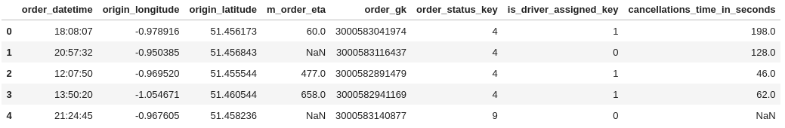
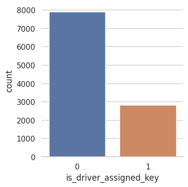
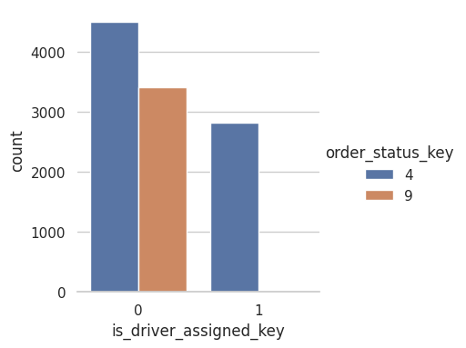

# [Анализ отменённых заказов такси](https://platform.stratascratch.com/data-projects/insights-failed-orders)

Gett, ранее известная как GetTaxi - это технологическая платформа, ориентированная на корпоративное управление наземным транспортом. У них есть приложение, в котором клиенты могут заказывать такси, а водители - принимать их предложения. В тот момент, когда клиент нажимает кнопку заказа в приложении, система подбора ищет наиболее подходящих водителей и предлагает им заказ. В этой задаче мы хотели бы изучить некоторые показатели для заказов, которые не были выполнены, т.е. клиент в итоге не получил машину.

    
Описание данных

* `order_datetime` - время создания заказа
* `origin_longitude`, `origin_latitude` - координаты (долгота и широта) заказа
* `m_order_eta` - ожидаемое время прибытия такси
* `order_gk` - номер заказа
* `order_status_key` - код статуса:
    - `4` - отменен клиентом;
    - `9` - отменен системой.
* `is_driver_assigned_key` - был ли назначен водитель
* `cancellation_time_in_seconds` - сколько секунд прошло до отмены

## Задания
Более подробно ход решения заданий и расчёты можно посмотреть в [ноутбуке](insights_from_failed_orders.ipynb), реализацию обработки данных карт в [скрипте](main.py).

    
1. Постройте распределение заказов по категориям: до и после назначения водителя, отмена клиентом или системой. В какой категории больше всего заказов?

Посмотрим сколько заказов были отменены до назначенения водителя:  

*Большая часть заказов (73,7%) была отменена до назначения водителя.*
    
Посмотрим кем отменялись заказы:  

*В случае, если водитель не был назначен, не наблюдается значительной разницы между количеством заказов, отменённых клиентом и отменённых системой, 57% и 43% соответственно. Заказы, в которых водитель был назначен, отменялись преимущественно пользователями.*

    
2. Постройте распределение невыполненных заказов по часам. Существует ли тенденция, что в определенные часы доля заказов той или иной категории аномально высока? В какие часы происходит больше всего отказов? Как это можно объяснить?

*Больше всего отказов происходит в восемь часов утра - время, когда люди едут на работу, и могут отменять заказы из-за большого времени ожидания машины; и в период с девяти вечера до часу ночи - снижается количество общественного транспорта на дорогах, увеличивается количество заказов такси и время прибытия.*

Рассмотрим топ-5 часов по количеству отменённых заказов:  

    
*Cохраняется тенденция сопоставимого числа отмен клиентом и системой при отказе до назначения водителя, и подавляющем большинстве отказов клиентом в случаях, если водитель был назначен.*

    
3. Постройте график среднего времени до отмены с водителем и без водителя по часам. Можно ли сделать какие-то выводы из этого графика?

*Среднее время до отмены заказа с назначенным водителем в любое время суток больше, чем в случаях, когда водитель не был назначен.*

    
4. Постройте распределение среднего времени прибытия по часам. Как можно объяснить этот график?

*Наибольшее ожидаемое время прибытия такси наблюдается в час пик: утром с 7 до 9 и вечером с 17 до 18.*

    
5. Используя <i>h3</i> и <i>folium</i>, рассчитайте, сколько гексагонов размера 8 содержат 80% всех заказов из исходных наборов данных, и визуализируйте эти гексы, раскрасив их по количеству отказов на карте.

*Наибольшее количество отмен заказов происходит в центре. Что, вероятно, связано с большим количеством создаваемых заказов в этой части города, и более плотным движением, увеличивающим время прибытия такси. Распределение заказов по ячейкам h3 представлено на карте, чем интенсивнее заливка, тем больше заказов было отменено в этой зоне.*

